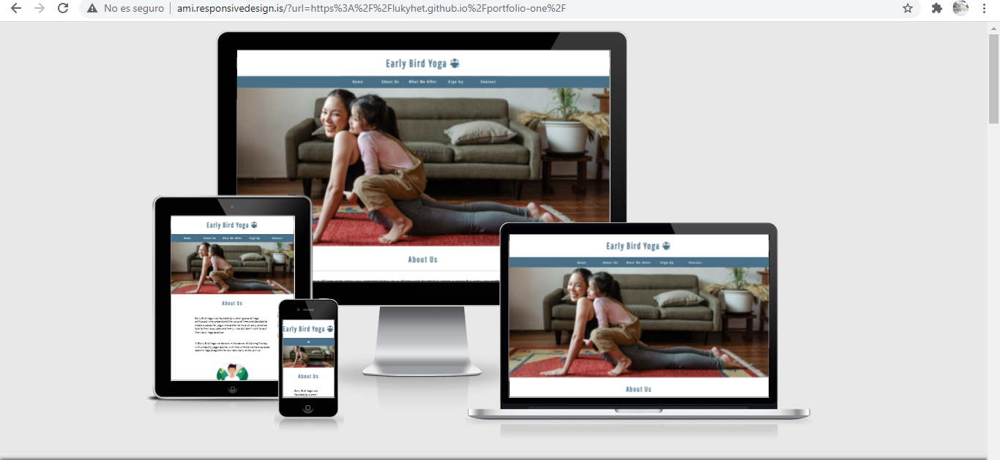
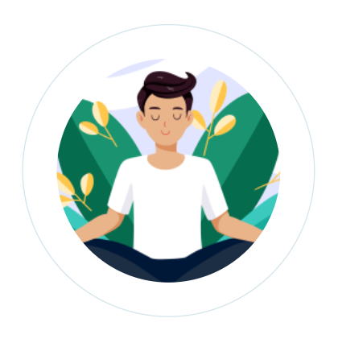

<h1 align="center">Early Bird Yoga Website</h1>

# Intorduction Early Bird Online Yoga

[View the live project here.] (https://lukyhet.github.io/portfolio-one/)

This is a website designed for an online Yoga academy that offers early morning classes.

Early Bird Yoga is a site that offers the solution for those who love to start the day with a self care type of physical activity like yoga but don´t have much time to do it. Their only alternative is to practice yoga very early in the morning, before the kids wake up, before getting ready for the office or any other demanding routine. Early Bird Yoga offers erly morning one on one online classes for adults, couples and "wake up" yoga classes for kids that don´t want to go to a yoga studio so early in the morning and don´t want to waste time scrolling on Youtube looking for the a good "enough" yoga video. 

Yoga it´s an ancient practice that helps creating a balance between body, mind and soul through the assanas or yoga positions that work through equilibrium, strenght and flexibility. Yoga contributes to the general well being of the individual, diminishes stress and anxiety, enhances muscular tone and strenght and gives the energy required to start a bussy day. The Early Bird Yoga Site offers weekly and monthly packages of Yoga classes in different styles, depending on the level of the Yogi.

## Features 

This is a one page website with a menu or navigation bar that directs the user to the four different sections in the page.

the four sections are easily identifiable by the contrast of the background and the clear subtitles.

These features are:

### Existing Features

- __Navigation Bar__

  - Featured on the top of the page, the full responsive navigation bar includes links to the  Home, About Us, Sign Up and Contact sections.

  -The navigation bar works as a dropdown menu in smaller screens making a transition for responsive design.

  - This section will allow the user to easily go to from section to section in all devices without having to scroll up and down to the desired section. 

- __Home-hero image_

  - The home includes a photograph to create a welcoming and inviting environment for the user interested in early online yoga classes. 
  - This section introduces the user to the website with an eye catching photograph.

  __The Color Palette _

  - The color scheme was inspired by the colors of the hero image and to catch them wih precition a sepcific website was used [IMAGECOLORPICKER.com](https://imagecolorpicker.com/), selecting only three colors that were used along the website, two hues of blue and one of pink to create a clean harmonious environment for the user.
  
  - This section introduces the user to the website with an eye catching photograph.
  

- __About Us section__

  - The ethos of the site is contained in a section called About Us that will allow the user to get some information about the phillosophy of the yoga online studio and the services offered by it.

  - The user will see the quality and knowledge behind Early Bird Yoga and an inspiring yoga related image enclosed in a circle givin the impretion of a bubble or some ethereal peaceful image.

  

  - __What we Offer__

  - This section will allow the user get to know the services offred by Early Bird Yoga, with a concise overview of the different types of yoga and how they would suit the different levels and needs of the user.

- __Sign Up section__

  - This page will allow the user to get signed up to Early Bird Online Yoga to start their yoga path from the comfort of their homes and at their early time of preference. The user will be able specify his or her yoga level, the user will be asked to submit their full name and email address too. All of that through a form designed in the same palette color as the rest of the elements in the website and with a submit botton that counts with confirmation of information sended. For that post method recipient was borrowed as recipient of the information sended by the user.

- __The Contact and Footer Sections__ 

  - The footer and contact section include:
  
- [x] a complete item links to the relevant social media sites for Early Bird Online Yoga. made and styled using Font Awesome icons  [fontawesome.com](https://fontawesome.com/).
- [x] Times and days of classes.
- [x] Contact data like email, phone number and adress.
- [x] An embedded google maps widget to facilitate the location of Early Bird Yoga in a hypotetical adress in Stockholm city.

All this features are responsive in different screen sizes.

  - The footer aims to encourage users to keep contact with Early Bird Online Yoga and conect via social networks.

### Features Left to Implement

- I would like to add a gallery with pictures of yoga teachers and students sharing online.

## Testing 

I have thested the responsivness of the website using three methods, the first one being developer tools of google chrome, the second is websites like Am I responsive [Am I responsive](http://ami.responsivedesign.is/) the third one using my own mobile phone.

The website has a clean appearance in the different screen sizes mentioned, looking more spacious in ipad and mobile phone sizes due to the media queries height used to fix gaps between the sections.

The most challenging bug to fix were the one in the dropdown menu that consisted in tiny see-through gaps between the elements of the list that seemed disharmonious, to fix these gaps I tried many strategies, being finally fixed with the help of an experienced developer who found the problem interesting and was willing to mentor me to fix the bug, I credit him in the comments.

The second bug that I found very challenging was to get rid of the massive space below the hero image, and then below the about us section, apparently caused by the small png. Image of the man doing yoga and later by the height of the about us section. 

In the process of fixing these bugs I did a lot of research finding many options and learning in the process how delicate is the CSS cascade system.

### Validator Testing and Unfixed Bugs.

- HTML
  - No errors were returned when passing through the official [W3C validator](https://validator.w3.org/nu/?doc=https%3A%2F%2Fcode-institute-org.github.io%2Flove-running-2.0%2Findex.html)
- CSS
  - No errors were found when passing through the official [(Jigsaw) validator](https://jigsaw.w3.org/css-validator/validator?uri=https%3A%2F%2Fvalidator.w3.org%2Fnu%2F%3Fdoc%3Dhttps%253A%252F%252Fcode-institute-org.github.io%252Flove-running-2.0%252Findex.html&profile=css3svg&usermedium=all&warning=1&vextwarning=&lang=en#css)

### 

You will need to mention unfixed bugs and why they were not fixed. This section should include shortcomings of the frameworks or technologies used. Although time can be a big variable to consider, paucity of time and difficulty understanding implementation is not a valid reason to leave bugs unfixed. 

## Deployment

This section should describe the process you went through to deploy the project to a hosting platform (e.g. GitHub) 

- The site was deployed to GitHub pages. The steps to deploy are as follows: 
  - In the GitHub repository, navigate to the Settings tab 
  - From the source section drop-down menu, select the Master Branch
  - Once the master branch has been selected, the page will be automatically refreshed with a detailed ribbon display to indicate the successful deployment. 

The live link can be found here - https://code-institute-org.github.io/love-running-2.0/index.html 

## Credits 

In this section you need to reference where you got your content, media and extra help from. It is common practice to use code from other repositories and tutorials, however, it is important to be very specific about these sources to avoid plagiarism. 

You can break the credits section up into Content and Media, depending on what you have included in your project. 

### Content 

- The text for the Home page was taken from Wikipedia Article A
- Instructions on how to implement form validation on the Sign Up page was taken from [Specific YouTube Tutorial](https://www.youtube.com/)
- The icons in the footer were taken from [Font Awesome](https://fontawesome.com/)

### Media

- The photos used on the home and sign up page are from This Open Source site
- The images used for the gallery page were taken from this other open source site

Congratulations on completing your Readme, you have made another big stride in the direction of being a developer! 

## Other General Project Advice

Below you will find a couple of extra tips that may be helpful when completing your project. Remember that each of these projects will become part of your final portfolio so it’s important to allow enough time to showcase your best work! 

- One of the most basic elements of keeping a healthy commit history is with the commit message. When getting started with your project, read through [this article](https://chris.beams.io/posts/git-commit/) by Chris Beams on How to Write  a Git Commit Message 
  - Make sure to keep the messages in the imperative mood 

- When naming the files in your project directory, make sure to consider meaningful naming of files, point to specific names and sections of content.
  - For example, instead of naming an image used ‘image1.png’ consider naming it ‘landing_page_img.png’. This will ensure that there are clear file paths kept. 

- Do some extra research on good and bad coding practices, there are a handful of useful articles to read, consider reviewing the following list when getting started:
  - [Writing Your Best Code](https://learn.shayhowe.com/html-css/writing-your-best-code/)
  - [HTML & CSS Coding Best Practices](https://medium.com/@inceptiondj.info/html-css-coding-best-practice-fadb9870a00f)
  - [Google HTML/CSS Style Guide](https://google.github.io/styleguide/htmlcssguide.html#General)

Getting started with your Portfolio Projects can be daunting, planning your project can make it a lot easier to tackle, take small steps to reach the final outcome and enjoy the process! 